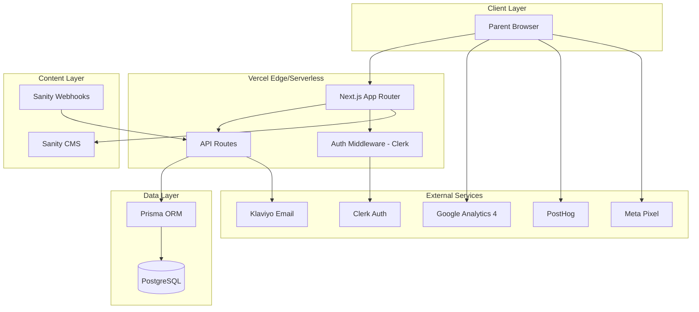

# Design Document: SafeNest Toys

## Overview

SafeNest Toys is a toy safety intelligence platform built as a Next.js App Router application. Phase 1 delivers a content-driven, SEO-optimized public website with editorial content from Sanity CMS, a transparent safety scoring engine, affiliate monetization, newsletter capture via Klaviyo, and user accounts via Clerk. The architecture prioritizes fast page loads, editorial integrity, and trust-building through transparency.

The system follows a headless CMS pattern: Sanity stores editorial content (reviews, guides, articles), PostgreSQL stores transactional data (users, clicks, favorites), and Next.js serves as the rendering and API layer. All scoring computation happens server-side to ensure consistency and auditability.

## Architecture

### High-Level Architecture Diagram



### Rendering Strategy

| Page Type | Strategy | Rationale |
|-----------|----------|-----------|
| Homepage | ISR (60s revalidate) | Balances freshness with performance |
| Toy Review | ISR (on-demand via webhook) | Content changes trigger revalidation |
| Category pages | ISR (on-demand via webhook) | Updates when reviews change |
| Blog/Articles | ISR (on-demand via webhook) | Webhook-triggered on publish |
| Programmatic SEO pages | Static generation at build | High volume, low change frequency |
| Recall Alerts | ISR (300s revalidate) | Safety-critical, needs freshness |
| Admin dashboard | SSR (no cache) | Real-time data needed |
| About/Contact/Transparency | Static | Rarely changes |

### Key Architectural Decisions

1. **Sanity for editorial, PostgreSQL for transactional** — Sanity provides rich content authoring; PostgreSQL handles structured relational data (users, clicks, favorites). This avoids forcing either system into an unnatural role.

2. **Server-side scoring computation** — Safety and Development scores are computed server-side during content save events. This ensures score consistency, auditability, and prevents client-side manipulation.

3. **On-demand ISR via webhooks** — Sanity webhooks trigger Next.js on-demand revalidation, meeting the 60-second content availability requirement without full rebuilds.

4. **Edge middleware for auth** — Clerk middleware at the edge handles session validation without adding latency to the rendering path for public pages.

5. **Affiliate clicks via API route** — Clicks route through a Next.js API endpoint that records the event then redirects. This ensures tracking without blocking the user experience.

## Components and Interfaces

### Application Structure

```
src/
├── app/
│   ├── (public)/                    # Public route group
│   │   ├── page.tsx                 # Homepage
│   │   ├── categories/
│   │   │   └── [slug]/page.tsx      # Category pages
│   │   ├── reviews/
│   │   │   └── [slug]/page.tsx      # Toy review pages
│   │   ├── guides/
│   │   │   └── [slug]/page.tsx      # Buying guides
│   │   ├── blog/
│   │   │   ├── page.tsx             # Blog listing
│   │   │   └── [slug]/page.tsx      # Blog posts
│   │   ├── recalls/page.tsx         # Recall alerts
│   │   ├── transparency/page.tsx    # Scoring methodology
│   │   ├── about/page.tsx
│   │   └── contact/page.tsx
│   ├── (auth)/                      # Authenticated route group
│   │   ├── favorites/page.tsx
│   │   └── account/page.tsx
│   ├── (admin)/                     # Admin route group
│   │   └── dashboard/
│   │       ├── clicks/page.tsx
│   │       └── links/page.tsx
│   ├── api/
│   │   ├── webhooks/
│   │   │   └── sanity/route.ts      # Sanity webhook handler
│   │   ├── affiliate/
│   │   │   └── click/route.ts       # Affiliate click tracking + redirect
│   │   ├── newsletter/
│   │   │   └── subscribe/route.ts   # Newsletter signup
│   │   ├── favorites/
│   │   │   └── route.ts             # Favorites CRUD
│   │   └── cron/
│   │       └── check-links/route.ts # Daily link health check
│   └── layout.tsx
├── components/
│   ├── ui/                          # shadcn/ui components
│   ├── layout/
│   │   ├── Header.tsx
│   │   ├── Footer.tsx
│   │   └── Navigation.tsx
│   ├── reviews/
│   │   ├── ReviewCard.tsx
│   │   ├── SafetyScoreDisplay.tsx
│   │   └── DevelopmentScoreDisplay.tsx
│   ├── newsletter/
│   │   ├── InlineSignupForm.tsx
│   │   └── PopupSignupForm.tsx
│   ├── affiliate/
│   │   ├── AffiliateLink.tsx
│   │   └── AffiliateDisclosure.tsx
│   ├── seo/
│   │   ├── JsonLd.tsx
│   │   ├── OpenGraphMeta.tsx
│   │   └── InternalLinks.tsx
│   ├── analytics/
│   │   ├── AnalyticsProvider.tsx
│   │   └── CookieConsentBanner.tsx
│   └── recalls/
│       ├── RecallBanner.tsx
│       └── RecallList.tsx
├── lib/
│   ├── sanity/
│   │   ├── client.ts                # Sanity client config
│   │   ├── queries.ts               # GROQ queries
│   │   └── schemas/                 # Sanity schema definitions
│   ├── scoring/
│   │   ├── safety-score.ts          # Safety score computation
│   │   └── development-score.ts     # Development score computation
│   ├── affiliate/
│   │   ├── link-builder.ts          # Affiliate URL construction
│   │   └── link-checker.ts          # Link health validation
│   ├── seo/
│   │   ├── structured-data.ts       # JSON-LD generators
│   │   ├── sitemap.ts               # Sitemap generation
│   │   └── programmatic-pages.ts    # SEO page generation logic
│   ├── newsletter/
│   │   └── klaviyo.ts               # Klaviyo API client
│   ├── analytics/
│   │   └── events.ts                # Analytics event helpers
│   └── db/
│       └── prisma.ts                # Prisma client singleton
├── prisma/
│   └── schema.prisma
└── middleware.ts                     # Clerk auth middleware
```

### Key Component Interfaces

#### Safety Score Display

```typescript
interface SafetyScoreDisplayProps {
  score: number; // 0-100
  breakdown: {
    materialSafety: { score: number; weight: 0.30 };
    chokingRisk: { score: number; weight: 0.30 };
    recallHistory: { score: number; weight: 0.20 };
    certificationPresence: { score: number; weight: 0.20 };
  };
}
```

#### Affiliate Link Component

```typescript
interface AffiliateLinkProps {
  productId: string;
  partnerId: string;
  destinationUrl: string;
  affiliateTag: string;
  children: React.ReactNode;
  sourcePageUrl: string;
}
```

#### Newsletter Form

```typescript
interface NewsletterFormProps {
  variant: 'inline' | 'popup';
  placement: 'homepage' | 'blog' | 'review';
}

type AgeRange = '0-2' | '3-5' | '6-8' | '9-12';

interface NewsletterSubmission {
  email: string;
  ageRange: AgeRange;
}
```

### API Route Contracts

#### POST /api/affiliate/click

```typescript
// Request body
interface AffiliateClickRequest {
  productId: string;
  sourcePageUrl: string;
  partnerId: string;
  destinationUrl: string;
}

// Response: 302 redirect to destination URL
// Side effect: records click in PostgreSQL
```

#### POST /api/newsletter/subscribe

```typescript
// Request body
interface NewsletterSubscribeRequest {
  email: string;
  ageRange: AgeRange;
}

// Response
interface NewsletterSubscribeResponse {
  success: boolean;
  message: string;
  alreadySubscribed?: boolean;
}
```

#### POST /api/webhooks/sanity

```typescript
// Sanity webhook payload
interface SanityWebhookPayload {
  _type: string;
  _id: string;
  _rev: string;
  operation: 'create' | 'update' | 'delete';
}

// Side effects: triggers ISR revalidation, recalculates scores if review
```

## Data Models

### PostgreSQL Schema (Prisma)

```prisma
model User {
  id          String     @id @default(cuid())
  clerkId     String     @unique
  email       String     @unique
  createdAt   DateTime   @default(now())
  updatedAt   DateTime   @updatedAt
  favorites   Favorite[]
  
  @@index([clerkId])
}

model Favorite {
  id          String   @id @default(cuid())
  userId      String
  reviewSlug  String   // References Sanity document slug
  createdAt   DateTime @default(now())
  user        User     @relation(fields: [userId], references: [id], onDelete: Cascade)
  
  @@unique([userId, reviewSlug])
  @@index([userId])
}

model AffiliateClick {
  id            String   @id @default(cuid())
  timestamp     DateTime @default(now())
  productId     String
  sourcePageUrl String
  partnerId     String
  sessionId     String   // Anonymized
  
  @@index([productId])
  @@index([timestamp])
  @@index([partnerId, timestamp])
}

model AffiliateLinkStatus {
  id            String    @id @default(cuid())
  productId     String
  partnerId     String
  destinationUrl String
  lastChecked   DateTime
  httpStatus    Int?
  isHealthy     Boolean   @default(true)
  flaggedAt     DateTime?
  
  @@unique([productId, partnerId])
  @@index([isHealthy])
}

model NewsletterSubscription {
  id          String   @id @default(cuid())
  email       String   @unique
  ageRange    String   // '0-2' | '3-5' | '6-8' | '9-12'
  klaviyoId   String?
  syncedAt    DateTime?
  createdAt   DateTime @default(now())
  
  @@index([email])
  @@index([ageRange])
}
```

### Sanity CMS Schemas

#### Toy Review Schema

```typescript
const toyReview = {
  name: 'toyReview',
  title: 'Toy Review',
  type: 'document',
  fields: [
    { name: 'productName', type: 'string', validation: (Rule) => Rule.required() },
    { name: 'slug', type: 'slug', options: { source: 'productName' } },
    { name: 'ageRange', type: 'object', fields: [
      { name: 'minMonths', type: 'number', validation: (Rule) => Rule.required().min(0) },
      { name: 'maxMonths', type: 'number', validation: (Rule) => Rule.required().min(0) },
    ]},
    { name: 'category', type: 'reference', to: [{ type: 'category' }] },
    // Safety scoring factors (0-100 each)
    { name: 'materialSafety', type: 'number', validation: (Rule) => Rule.required().min(0).max(100) },
    { name: 'chokingRisk', type: 'number', validation: (Rule) => Rule.required().min(0).max(100) },
    { name: 'recallHistory', type: 'number', validation: (Rule) => Rule.required().min(0).max(100) },
    { name: 'certificationPresence', type: 'number', validation: (Rule) => Rule.required().min(0).max(100) },
    // Development scoring factors (0-100 each)
    { name: 'motorSkills', type: 'number', validation: (Rule) => Rule.required().min(0).max(100) },
    { name: 'cognitiveSkills', type: 'number', validation: (Rule) => Rule.required().min(0).max(100) },
    { name: 'sensoryEngagement', type: 'number', validation: (Rule) => Rule.required().min(0).max(100) },
    // Computed scores (set by webhook/server)
    { name: 'safetyScore', type: 'number', readOnly: true },
    { name: 'developmentScore', type: 'number', readOnly: true },
    { name: 'materials', type: 'array', of: [{ type: 'string' }], validation: (Rule) => Rule.required().min(1) },
    { name: 'chokingHazardAssessment', type: 'text', validation: (Rule) => Rule.required() },
    { name: 'certifications', type: 'array', of: [{ type: 'string' }] },
    { name: 'pros', type: 'array', of: [{ type: 'string' }], validation: (Rule) => Rule.required().min(1) },
    { name: 'cons', type: 'array', of: [{ type: 'string' }], validation: (Rule) => Rule.required().min(1) },
    { name: 'alternatives', type: 'array', of: [{ type: 'reference', to: [{ type: 'toyReview' }] }], validation: (Rule) => Rule.required().min(1) },
    { name: 'affiliateLinks', type: 'array', of: [{ type: 'affiliateLink' }] },
    { name: 'body', type: 'blockContent' },
    { name: 'hasActiveRecall', type: 'boolean', initialValue: false },
    { name: 'needsReview', type: 'boolean', initialValue: false },
  ],
};
```

#### Recall Alert Schema

```typescript
const recallAlert = {
  name: 'recallAlert',
  title: 'Recall Alert',
  type: 'document',
  fields: [
    { name: 'affectedProduct', type: 'string', validation: (Rule) => Rule.required() },
    { name: 'recallDate', type: 'date', validation: (Rule) => Rule.required() },
    { name: 'recallReason', type: 'text', validation: (Rule) => Rule.required() },
    { name: 'issuingAuthority', type: 'string', validation: (Rule) => Rule.required() },
    { name: 'recommendedAction', type: 'text', validation: (Rule) => Rule.required() },
    { name: 'officialNoticeUrl', type: 'url' },
    { name: 'affectedReviews', type: 'array', of: [{ type: 'reference', to: [{ type: 'toyReview' }] }] },
    { name: 'isResolved', type: 'boolean', initialValue: false },
    { name: 'publishedAt', type: 'datetime', validation: (Rule) => Rule.required() },
  ],
};
```

## Correctness Properties

*A property is a characteristic or behavior that should hold true across all valid executions of a system—essentially, a formal statement about what the system should do. Properties serve as the bridge between human-readable specifications and machine-verifiable correctness guarantees.*

### Property 1: Safety Score bounded weighted sum

*For any* four factor values (materialSafety, chokingRisk, recallHistory, certificationPresence) each in the range [0, 100], the computed Safety Score SHALL equal (materialSafety × 0.30 + chokingRisk × 0.30 + recallHistory × 0.20 + certificationPresence × 0.20) and the result SHALL always be in the range [0, 100].

**Validates: Requirements 3.1, 3.7**

### Property 2: Development Score bounded weighted sum

*For any* three factor values (motorSkills, cognitiveSkills, sensoryEngagement) each in the range [0, 100], the computed Development Score SHALL equal (motorSkills × 0.40 + cognitiveSkills × 0.35 + sensoryEngagement × 0.25) and the result SHALL always be in the range [0, 100].

**Validates: Requirements 3.2, 3.7**

### Property 3: Affiliate click always redirects

*For any* affiliate click event, regardless of whether the database recording succeeds or fails, the system SHALL redirect the user to the affiliate destination URL without delay.

**Validates: Requirements 5.2, 5.7**

### Property 4: Invalid email format rejection

*For any* string that does not conform to standard email format (missing @, missing domain, invalid characters), the newsletter system SHALL reject the submission, display a validation error, and SHALL NOT sync any data to Klaviyo.

**Validates: Requirements 6.5**

### Property 5: Content publication requires all mandatory fields

*For any* Toy Review submission where at least one required field (product name, age range, materials, choking hazard assessment, pros, cons, alternatives, or any scoring factor) is missing, the system SHALL prevent publication and display validation errors listing all missing fields.

**Validates: Requirements 2.2, 2.7, 3.5**

### Property 6: Alternative product from different brand

*For any* Toy Review, the alternatives list SHALL contain at least one product from a brand different from the primary reviewed product's brand. If this constraint is not met, publication SHALL be prevented.

**Validates: Requirements 12.3, 12.6**

### Property 7: No orphaned favorites on user deletion

*For any* user with associated favorites, when that user is deleted from the system, all favorite records referencing that user SHALL also be deleted, leaving zero orphaned favorite records.

**Validates: Requirements 9.7**

### Property 8: Analytics scripts load only with consent

*For any* consent state, analytics scripts (GA4, PostHog, Meta Pixel) SHALL be loaded if and only if the user has granted cookie consent. If consent is declined or not yet given, zero analytics scripts SHALL be present in the page.

**Validates: Requirements 10.6, 10.7**

### Property 9: Duplicate email subscription prevention

*For any* email address that already exists in the newsletter subscription store, a subsequent subscription attempt with the same email SHALL NOT create a duplicate record and SHALL return an "already subscribed" indication.

**Validates: Requirements 6.9**

### Property 10: Programmatic pages require minimum review count

*For any* search pattern combination (age, category, toy type) where fewer than 3 matching Toy Reviews exist, the system SHALL NOT generate a programmatic landing page and SHALL return a 404 response for that URL.

**Validates: Requirements 4.7**

## Error Handling

### Client-Side Errors

| Scenario | Behavior |
|----------|----------|
| Page not found (404) | Display dedicated error page with navigation links to Homepage |
| Network failure on form submit | Display inline error message, preserve form state, prompt retry |
| Clerk auth session expired | Redirect to login page, preserve intended destination URL for post-login redirect |
| Clerk service unavailable | Display message that authentication is temporarily unavailable; allow continued access to public content |
| Cookie consent not given | Do not load any analytics scripts; serve page without tracking |

### Server-Side Errors

| Scenario | Behavior |
|----------|----------|
| Database query failure | Log error with context (no internal details exposed to client), return generic error message |
| Database connection unavailable | Retry up to 3 times with 2-second delay between attempts; after exhaustion, return "service temporarily unavailable" |
| Affiliate click recording failure | Log failure for admin review, still perform redirect to affiliate destination without delay |
| Klaviyo sync failure or timeout (>10s) | Display error message to user indicating subscription could not be completed, prompt retry |
| Sanity webhook processing failure | Log error, do not crash; content remains at previous cached version until next successful revalidation |
| External recall data source unavailable | Serve most recently cached recall data; display date/time of last successful refresh |
| Affiliate link health check failure (4xx/5xx/timeout) | Flag link for admin review, send notification within 24 hours |
| CI pipeline timeout (>15 minutes) | Mark pipeline as failed, notify admin via configured alerting channel |
| Deployment failure | Notify admin within 5 minutes with failing commit reference |

### Validation Errors

| Scenario | Behavior |
|----------|----------|
| Scoring factor outside 0–100 | Reject input, display error indicating acceptable range |
| Missing required Toy Review fields | Prevent publication, display list of missing fields |
| Missing alternative from different brand | Prevent publication, display specific error about brand diversity requirement |
| Invalid email format on newsletter | Display inline validation error, do not submit to Klaviyo |
| Missing age range on newsletter | Display validation error, do not submit to Klaviyo |
| Medical claims without cited source | Reject content submission, display policy violation error |

### Error Design Principles

1. **Never expose internals** — Database table names, query syntax, connection strings, and stack traces are never shown to users.
2. **Graceful degradation** — When external services (Clerk, Klaviyo, recall sources) are unavailable, the platform continues serving public content.
3. **Redirect never blocked** — Affiliate click tracking failures must never prevent or delay user redirection.
4. **Retry with backoff** — Database connection failures use bounded retries (3 attempts, 2s delay) before surfacing errors.
5. **Admin visibility** — All server-side errors are logged with sufficient context for debugging; critical failures trigger admin notifications.

## Testing Strategy

### Unit Tests

Unit tests cover specific examples, edge cases, and component-level behavior:

- **Scoring functions**: Verify computation with known inputs (e.g., all factors at 50 → Safety Score = 50, all factors at 100 → score = 100, all factors at 0 → score = 0)
- **Email validation**: Test specific valid/invalid email patterns (missing @, double dots, valid international domains)
- **Affiliate link builder**: Verify URL construction with specific partner tags and product IDs
- **Newsletter form validation**: Test specific age range selections and empty submissions
- **JSON-LD generation**: Verify structured data output for known review inputs
- **Cookie consent logic**: Verify script injection/removal for consent state changes
- **Prisma cascade behavior**: Verify favorites deletion on user removal with specific test data

### Property-Based Tests

Property-based tests verify universal correctness properties using generated inputs. The project will use **fast-check** as the PBT library (TypeScript/JavaScript ecosystem, integrates with Vitest).

**Configuration:**
- Minimum 100 iterations per property test
- Each test tagged with comment: `Feature: safenest-toys, Property {N}: {title}`

**Properties to implement:**

| Property | Module Under Test | Generator Strategy |
|----------|------------------|-------------------|
| Property 1: Safety Score bounded weighted sum | `lib/scoring/safety-score.ts` | Generate 4 random integers in [0, 100] |
| Property 2: Development Score bounded weighted sum | `lib/scoring/development-score.ts` | Generate 3 random integers in [0, 100] |
| Property 3: Affiliate click always redirects | `api/affiliate/click/route.ts` | Generate random click events with mocked DB (success/failure) |
| Property 4: Invalid email format rejection | `api/newsletter/subscribe/route.ts` | Generate random non-email strings via fast-check string arbitraries |
| Property 5: Content publication requires all mandatory fields | Sanity validation / webhook handler | Generate random subsets of missing fields from required field list |
| Property 6: Alternative product from different brand | Content validation logic | Generate random review data with random brand assignments |
| Property 7: No orphaned favorites on user deletion | Prisma cascade logic | Generate random user with N favorites, delete, query orphans |
| Property 8: Analytics scripts load only with consent | `components/analytics/AnalyticsProvider.tsx` | Generate random consent states (true/false/undefined) |
| Property 9: Duplicate email subscription prevention | `api/newsletter/subscribe/route.ts` | Generate random emails, subscribe twice, verify count = 1 |
| Property 10: Programmatic pages require minimum review count | `lib/seo/programmatic-pages.ts` | Generate random category/age combinations with 0–2 reviews |

### Integration Tests

Integration tests verify external service interactions and end-to-end flows:

- **Sanity webhook → ISR revalidation**: Verify content availability within 60 seconds of webhook
- **Clerk auth flow**: Verify signup creates PostgreSQL user record linked to Clerk ID
- **Klaviyo sync**: Verify subscriber record creation with correct age range segmentation
- **Affiliate link health checker**: Verify daily cron correctly flags unhealthy links
- **Sitemap regeneration**: Verify XML sitemap updates within 5 minutes of content change
- **Database retry logic**: Verify 3-retry behavior with simulated connection failures

### End-to-End Tests

E2E tests (using Playwright) cover critical user journeys:

- Parent browses homepage → clicks review → clicks affiliate link → redirect works
- Parent signs up for newsletter → receives confirmation → Klaviyo record exists
- Parent creates account → saves favorite → deletes account → no orphaned data
- Cookie consent declined → verify no analytics network requests
- Admin publishes review with missing fields → sees validation errors

### Performance Tests

- Lighthouse CI in pipeline: accessibility ≥ 90, performance ≥ 80
- First contentful paint < 3s on simulated 3G
- Analytics scripts do not increase LCP by more than 100ms
